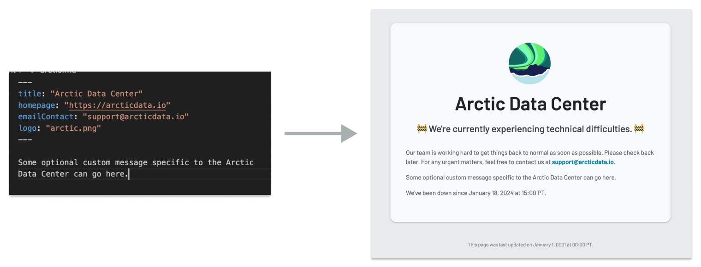

# MetacatUI Status Notification Pages 🐈‍⬛⚠️

Pages to display in the rare case that the server(s) running MetacatUI are down. There is one page for each MetacatUI instance that we manage.



## Quick! Update the status pages for all MetacatUI instances!

In the [hugo.yaml](./hugo.yaml) file, update the "downSince" date time field that is under the "params" section. Set this to the date and time that the outage began, in the format "YYYY-MM-DDTHH:MM:SSZ" **In Pacific Time**.

Once this file is updated, GitHub actions will rebuild the site and deploy it to the gh-pages branch. The status pages will be updated within a few minutes.

[ TODO: Steps to update the DNS records to point to the new status pages HERE ]

## Set up to develop locally:

1. Install Hugo. On macOS, you can use Homebrew:

```bash
brew install hugo
```

Otherwise, see  https://gohugo.io/getting-started/installing/

2. Clone this repository:

```bash
git clone [ TODO: Final repo URL here ]
cd metacatui-status-pages
```

3. Start the Hugo server to preview the site:

```bash
hugo server
```

This will start a local server at http://localhost:1313/. As you make changes to the site, the server will automatically reload to show the changes.

## Add a status page for a new MetacatUI instance:

1. From command line, run:

```bash
hugo new name-of-new-instance.md
```

2. The new markdown template file will be created in the `content` directory. Edit the file to include the details for the new MetacatUI instance.

- **title**: The title of the MetacatUI instance.
- **homepage**: The URL of the homepage for the MetacatUI instance.
- **emailContact**: The email address to contact for support. Optional.
- **logo**: The filename of the logo image to display on the status page. The image goes in the `static/logos` directory.
- **downSince**: Optional. This date and time will override the global "downSince" date and time in the `hugo.yaml` file. Use this field to specify a different date and time for when the MetacatUI instance went down. The format is "YYYY-MM-DDTHH:MM:SS" **In Pacific Time**.

You can also add a custom message to the status page in markdown, below the front matter. This message will be displayed below the status message. If no custom message is required, then delete the example custom message from the markdown file.

3. Add the repository's logo image to the `static/logos` directory.

4. Start the Hugo server to preview the site:

```bash
hugo server
```

Navigate to the new status page at http://localhost:1313/name-of-new-instance/

5. Once you are satisfied with the changes, commit and push the changes to the repository. GitHub actions will rebuild the site and deploy it to the gh-pages branch. The status pages will be updated within a few minutes!